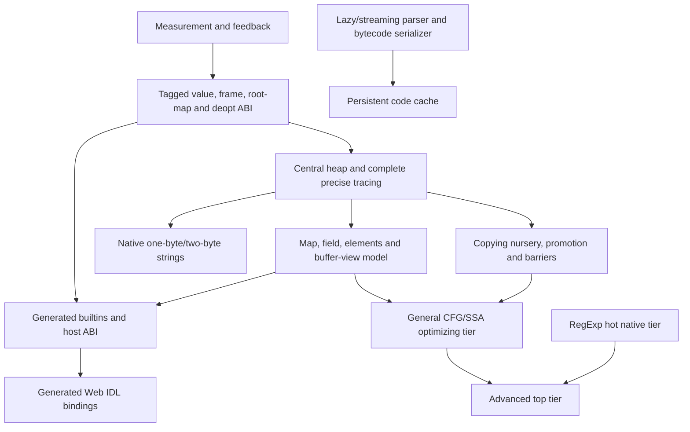

# Lumen next-generation optimization roadmap

- Status: long-term planning and progress checklist
- Created: 2026-09-01
- Initial source baseline: `d561eb022a9f` (`lumen 0.1.3`, AArch64)
- Primary goals: complete standards compliance and maximum real-world execution efficiency

This document records the architectural performance investigation that followed Lumen's first
full standards and lifecycle audit. It is intentionally separate from
`AUDIT_REMEDIATION.md`: that document tracks concrete audit findings and browser regressions,
while this one tracks the multi-stage work required to evolve Lumen into a modern optimizing
JavaScript engine.

This is a living checklist. Check an item only when its implementation, focused tests, broader
conformance tests, performance measurements, and required real-site gates are complete. Record
important measurements and design decisions near the relevant item rather than relying on
memory or transient files under `/tmp`.

## Non-negotiable engineering rules

- Official standards define observable behavior. ECMA-262, ECMA-402, WebAssembly, WHATWG, W3C,
  and IETF algorithms take precedence over current Lumen behavior, benchmark expectations, and
  the behavior of any comparison engine.
- V8 is the performance target and a valuable architecture reference, not a normative source of
  JavaScript or Web Platform semantics.
- Optimizations must be general. Do not recognize benchmark names, fixture-specific object
  graphs, website domains, or site-specific source patterns.
- An optimization guard may fail, but the failure must resume the always-correct tier at the
  exact semantic point with the exact observable state required by the standard.
- Do not turn an implementation guard, resource budget, recursion guard, cache size, or compiler
  limitation into a JavaScript semantic result. Where the host must report resource exhaustion,
  keep it distinct from ordinary language failure and from host interruption.
- The tree-walking interpreter remains the reference oracle until another independently verified
  reference tier exists. Bytecode and native tiers must be differentially testable against it.
- Incremental delivery is mandatory. Keep risky architecture behind diagnostics or kill switches
  until it survives conformance, stress, benchmark, and browser workload gates.
- Real websites are compatibility evidence. Correct the general standards defect they expose;
  never add a domain-specific workaround when a standards-correct implementation exists.
- Performance includes responsiveness, latency, memory use, pause time, startup, and code size—not
  just steady-state throughput or one aggregate benchmark score.
- Preserve bounded caches, zero idle spin, contained host/resource failure, and one live foreground
  page Agent.

## Authoritative and primary references

Read the relevant normative sections in context before changing observable behavior. Keep section
links in code comments or commit messages where they will help future maintainers.

- [ECMA-262, ECMAScript Language Specification](https://tc39.es/ecma262/)
- [ECMA-262 shared-memory model](https://tc39.es/ecma262/multipage/memory-model.html)
- [ECMA-402, Internationalization API Specification](https://tc39.es/ecma402/)
- [The Unicode Standard](https://www.unicode.org/versions/latest/)
- [Unicode Technical Standard #35 / LDML](https://unicode.org/reports/tr35/)
- [Unicode CLDR specification and data](https://cldr.unicode.org/index/cldr-spec)
- [Test262](https://github.com/tc39/test262)
- [Web IDL](https://webidl.spec.whatwg.org/)
- [HTML Living Standard](https://html.spec.whatwg.org/)
- [WebAssembly specifications](https://webassembly.github.io/spec/)
- [WebAssembly JavaScript Interface](https://webassembly.github.io/spec/js-api/)
- [Web Platform Tests](https://github.com/web-platform-tests/wpt)

The following V8 material informs architecture and tradeoffs only:

- [Sparkplug baseline compiler](https://v8.dev/blog/sparkplug)
- [Maglev fast optimizing compiler](https://v8.dev/blog/maglev)
- [V8's move back to a CFG IR](https://v8.dev/blog/leaving-the-sea-of-nodes)
- [Hidden classes and shared descriptors](https://v8.dev/docs/hidden-classes)
- [Fast properties](https://v8.dev/blog/fast-properties)
- [Elements kinds](https://v8.dev/blog/elements-kinds)
- [Orinoco major collection](https://v8.dev/blog/trash-talk)
- [Orinoco young-generation collection](https://v8.dev/blog/orinoco-parallel-scavenger)
- [Pointer compression](https://v8.dev/blog/pointer-compression)
- [RegExp tier-up](https://v8.dev/blog/regexp-tier-up)
- [Background compilation](https://v8.dev/blog/background-compilation)
- [Code caching](https://v8.dev/blog/improved-code-caching)
- [Torque builtins](https://v8.dev/docs/torque-builtins)
- [Lazy parsing](https://v8.dev/blog/preparser)

## Initial performance evidence

### Classic V8 v7 suite

One local `scripts/bench-compare.sh` run on the accepted engine revision produced the following
directional baseline. The machine has 20 AArch64 cores; comparison versions were Node 24.19.0 and
Bun 1.4.0. Scores vary with scheduling and thermals, so future decisions should use multiple
interleaved, affinity-controlled samples rather than comparing one run to this table. In
particular, the final column is a directional ratio from this single run, not a stable performance
claim.

| Benchmark | Node | Bun | Lumen JIT | Directional Node / Lumen |
| --- | ---: | ---: | ---: | ---: |
| Richards | 16,670 | 26,946 | 1,161 | 14.36x |
| DeltaBlue | 46,131 | 17,713 | 993 | 46.46x |
| Crypto | 27,265 | 36,688 | 7,424 | 3.67x |
| RayTrace | 43,838 | 57,793 | 2,027 | 21.63x |
| EarleyBoyer | 45,805 | 29,025 | 892 | 51.35x |
| RegExp | 7,313 | 5,648 | 417 | 17.54x |
| Splay | 27,821 | 28,343 | 3,162 | 8.80x |
| NavierStokes | 20,034 | 20,673 | 12,674 | 1.58x |
| Composite | 25,370 | 23,630 | 2,003 | 12.67x |

Richards remains useful as a regression signal, but it is not a product target and must not drive
fixture-shaped code. Speedometer and actual page workloads matter more.

### Targeted tier and slow-path diagnostics

The current JIT is valuable and should remain as the baseline/native fallback:

- DeltaBlue: interpreter 64.5, bytecode 157, JIT 947 in one affinity-controlled diagnostic run.
- EarleyBoyer: bytecode 381, JIT 878 in the corresponding run.

Opt-in JIT counters exposed the remaining general costs. Counter-enabled scores themselves are
not comparable because instrumentation is expensive; execution counts are the useful evidence.

- DeltaBlue reached generic helpers for approximately 530,000 `New` operations, 496,000
  `GetPropLocal` operations, 97,000 `GetMethod` operations, and many property writes.
- EarleyBoyer reached helpers for approximately 9.7 million `New` operations, 3.6 million
  `GetElemLocal` operations, 2.4 million `LoadName` operations, 1.3 million `Typeof` operations,
  and hundreds of thousands of captured-binding and call operations.
- The EarleyBoyer diagnostic also triggered repeated full-heap cycle collections even though the
  surviving object population stayed relatively small. This is a classic generational-GC case:
  enormous short-lived allocation with a small live set.
- NavierStokes remains comparatively close to Node because its hot numeric work fits Lumen's
  register-resident numeric chains. This demonstrates that native arithmetic is not the main
  obstacle; general object/control execution is.
- RegExp remains roughly 17.5x behind Node despite recent caching and polling improvements. Its
  flat matcher program is still executed by a recursive Rust backtracker rather than a native
  hot-pattern tier.

### Browser evidence

- Speedometer 3.1 can be activated through its real Start control and can complete official
  summaries, proving that continued work exercises useful Web Platform and ECMAScript behavior.
- Ten Speedometer iterations previously took about 56 minutes and accumulated roughly 6.7 GiB,
  exposing both throughput and lifetime/allocation work that short engine fixtures do not show.
- YouTube consent rejection/search, Twitch search/cards, Steam search/catalog, Instagram, and
  other JS-heavy pages are required semantic workloads. Network availability, bot defenses, and
  changing content make them unsuitable as the only regression oracle, so repeatable local replay
  workloads are also required.
- Ars Technica is intentionally excluded from future live-site rotation after the origin
  rate-limited this test client; use other JS-heavy origins instead.

### Current Phase 0 evidence

The current-tree release binary at `6ead595fa325533ea2a46b735a050b183c6b91c6` completed the
required seven-sample, affinity-controlled Node/V8-versus-Lumen matrix on 2026-09-01. The
machine-readable report is
`benchmark-results/engine-matrix-20260901T195955106211Z.json` (SHA-256
`4e0799eef5f7840d2415940673a6c4a91ee651f571fa228283371ef8f794ecd1`). Lumen's composite median
was 1,904.46 (95% bootstrap interval 1,902.49–1,905.99); component medians were Crypto 7,293,
DeltaBlue 840, EarleyBoyer 874, NavierStokes 12,601, RayTrace 1,876, RegExp 436, Richards
1,051, and Splay 2,968. Managed requested-byte snapshots were complete for every Lumen sample.
The optional Bun leg is currently retained separately because Bun 1.4 rejects the upstream
fixture's legacy undeclared `setupEngine` assignment before the Crypto workload begins; no Bun
numbers are mixed into this required baseline.

## Quantitative decision and exit policy

Correctness gates are absolute: no score, memory reduction, or phase target permits a standards or
real-site regression. Performance targets decide whether an architecture earns its complexity;
they do not redefine JavaScript behavior.

Phase 0 must replace the directional samples above with a locked, reproducible baseline before any
broad behavior-changing phase begins. The numeric targets below are provisional engineering exit
criteria against that accepted baseline on the primary AArch64 machine. Phase 0 may tighten or
recalibrate a target when variance or a better metric makes that necessary, but the result and
rationale must be recorded before implementation. A missed target requires diagnosis and an
explicit keep/rework/revert decision; checking off implementation tasks alone does not complete a
phase.

| Phase / milestone | Initial quantitative exit target |
| --- | --- |
| 0: reproducible baseline | Interleaved samples reach a 95% confidence-interval half-width of at most 3% for stable engine components; noisy workloads retain their measured variance and use a predeclared regression threshold. Every report includes elapsed/CPU time, peak and post-GC heap/RSS, pause distribution, compile time, and code bytes where applicable. |
| 1: feedback and observability | Disabled telemetry has no slowdown greater than 1% at 95% confidence on the engine matrix and allocates no per-event data. Enabled profiles account for at least 95% of measured allocation bytes and timed runtime-helper/GC/compiler work, with bounded loss reported rather than hidden. |
| 2: tagged ABI | `TaggedValue` is 8 bytes; migrated frames use no hidden whole-frame widen/repack path; forced relocation/root/deopt tests have zero differential failures; the engine matrix has no unexplained regression greater than 3%. |
| 3A: central heap and nursery | At least 90% of eligible ordinary allocations in the locked object-heavy workloads use the nursery bump path. EarleyBoyer major/full-heap bytes scanned fall by at least 75% and GC wall time by at least 50%. A warmed multi-iteration Speedometer run shows no linear post-GC live-heap growth and at least 50% less major-collection work. |
| 3B: mature collection | Representative browser replays keep GC-induced Agent stalls below 8 ms at p95 and 16 ms at p99 on the primary machine, without losing more than 5% throughput. Parallel/concurrent work is retained only when total CPU and user-visible latency both justify it. |
| 4: Maps, properties, elements, and buffers | Common fast objects retain no per-instance property names; generic property/element helper entries in DeltaBlue and EarleyBoyer fall by at least 50%; the object-heavy score geometric mean improves by at least 25% and its peak managed-heap footprint by at least 20%. |
| 5: general optimizing tier | DeltaBlue and EarleyBoyer each improve by at least 2x over the locked baseline JIT. Stable optimized sites deopt on fewer than 2% of post-warmup entries; p95 optimizing compile time stays below 10 ms per selected function and median code size below 2x baseline-native code for the same function. |
| 6: native RegExp | The first native subset improves the locked RegExp corpus by at least 3x. Phase completion reaches at least 50% of current Node/V8 throughput on that corpus with no unsupported-pattern or adversarial-case regression. |
| 7: native strings | The locked string corpus improves by at least 1.5x and uses at least 25% fewer managed bytes, while property-heavy and startup workloads remain within their regression thresholds. |
| 8: generated builtins / host ABI | Time in the migrated hot-helper set falls by at least 50%, and affected Speedometer components improve by at least 15% without moving work into allocation, GC, or callback slow paths. |
| 9: generated Web IDL | Median engine-side overhead for the migrated hot DOM member families falls by at least 50%, and affected DOM-heavy replay components improve by at least 20%, with zero relevant WPT regression. |
| 10: frontend and caches | Platform-prelude/cold compile time falls by at least 30%; unchanged warm navigations spend at least 50% less time parsing/compiling and achieve at least a 90% bytecode-cache hit rate after warmup; binary/page-fault/table-residency targets are locked after measuring generated Unicode/CLDR data. |
| 11: advanced optimizing tier | Reach at least 60% of current Node/V8 on the locked product-weighted engine aggregate as an intermediate milestone. The project target remains competitive parity with V8 on representative workloads; 60% is not completion. |
| 12: backends and parallelism | x86-64 and AArch64 pass identical generated-code/deopt suites; retained background work improves eligible wall time by at least 20% without exceeding the browser replay p99 responsiveness budget. |

Speedometer is a whole-browser signal, so it must be compared to the preceding accepted TRust
checkpoint and inspected component-by-component rather than presented as a direct JS-engine ratio
to Node. Node/V8 ratios apply only to identical engine workloads. All percentages above use
interleaved distributions, not a single best run.

## Current architecture: strengths to preserve

- The tree walker provides a broad, standards-oriented semantic oracle.
- The bytecode VM already removes much AST dispatch and retains exact language helpers.
- The native template JIT removes bytecode dispatch, emits real control flow, and has effective
  fast paths for several numeric, property, call, constructor, array, and string operations.
- Four-way property and call inline caches, shared shape IDs, prototype guards, direct compiled
  calls, constructor feedback, dense array support, and native Web IDL indexed objects are useful
  foundations.
- `jit_ir.rs` already contains target-neutral CFG construction, stack-depth analysis, dominators,
  natural loops, SSA-like region values, representations, and side-exit state.
- `PackedValue` proves that ordinary values can be represented in eight bytes at storage
  boundaries.
- Lumen's owned RegExp parser and flat matcher program give us a suitable input for a native
  RegExp tier without adding a foreign engine.
- Lumen's thin string avoids the old quadratic append behavior and has useful ASCII fast paths.
- The existing differential tests, Test262 runner, WPT runner, browser harness, diagnostic kill
  switches, and real-site gates provide a much better safety foundation than the original audit
  had.

## Current architecture: primary limitations

### Execution and tiering

- A function is compiled as a whole or falls back; the general tiers do not support arbitrary
  deoptimization back to an exact bytecode program point.
- The native JIT still calls a Rust helper for many individual bytecodes. Constructor, object,
  name, captured-binding, exotic-object, and uncommon control operations dominate object-heavy
  workloads.
- General CFG/SSA infrastructure exists, but only selected region shapes have native lowerings.
- Inlining is a bounded, one-shot speculative recompilation rather than an adaptive optimizing
  tier informed by persistent type and branch feedback.
- Hot loops can compile early, but there is no general on-stack replacement into an optimized
  loop and no repeatable deoptimization/reoptimization policy.
- Register residency is implemented by specialized chains and fixed patterns rather than general
  liveness analysis and register allocation.

### Values, ownership, and frames

- The ergonomic execution `Value` is a 16-byte Rust enum. Locals, VM operands, host arguments,
  and many helpers therefore move twice the data of an eight-byte tagged value.
- `PackedValue` is primarily a property/storage representation; crossing to ordinary execution
  values still packs, unpacks, clones, or drops reference-counted payloads.
- `PACKED_LOCAL_SLOTS` is currently disabled. Simply enabling it is not a safe optimization:
  generic helpers widen and repack whole local frames, and several optimized regions currently
  reject packed slots. The correct destination is one tagged representation understood directly
  by every tier and helper.
- JIT code reads probed Rust standard-library and `RcBox` layouts. Defensive validation preserves
  correctness, but the design couples hot code to `Rc`, `RefCell`, and compiler/library layout
  details that a central engine heap should own explicitly.

### Heap and collection

- Every object is an `Rc<RefCell<Object>>`. Object graph mutation pays borrow checks, and strong
  edges pay reference-count changes even though an ECMAScript Agent executes JavaScript on one
  thread at a time.
- Every object is registered weakly, and the cycle collector must snapshot and traverse the live
  object/scope graph, reconstruct internal reference counts, classify roots, handle ephemerons,
  clear side tables, and break cycles.
- Collection is whole-heap rather than generational. Short-lived page and benchmark objects cause
  work proportional to the retained heap instead of the nursery.
- Objects and their property buffers are independently allocated, reducing locality and making
  bump allocation impossible.

### Objects and arrays

- Shape IDs encode ordered key sequences, but objects still retain their own property keys and
  descriptors in a vector.
- Attributes and prototype identity are not represented by a shared heap Map/descriptor object in
  the way an optimizing compiler ultimately needs.
- Common instance fields are not stored directly in an object allocation.
- Arrays maintain ordinary property information plus dense indexing and sometimes a numeric
  mirror. Fast writers may need dual stores and invalidation rather than writing one canonical
  specialized elements representation.
- A global prototype epoch is safe but invalidates more speculation than per-chain validity cells
  or dependencies would.
- Typed arrays, `ArrayBuffer`, `SharedArrayBuffer`, `DataView`, and `Atomics` are implemented, but
  their backing stores and view metadata live behind side tables and generic object/property
  paths. They do not yet have an optimizer-facing buffer/view representation with direct guarded
  loads, stores, detachment/resize epochs, or native atomic operations.

### RegExp

- Patterns compile to a flat instruction program, but matching is still a Rust interpreter with
  recursive calls at genuine backtracking points.
- There is no cold-bytecode/hot-native tier, native register allocation, compiled capture stack,
  or compiled ASCII/UTF-16 character dispatch.
- Literal and dead-result fast paths reduce wrapper overhead but do not remove matcher dispatch.

### Strings

- Engine strings are stored as UTF-8 plus a surrogate-smuggling scheme, while ECMAScript strings
  are sequences of UTF-16 code units.
- ASCII indexing is cheap, but non-ASCII length/indexing often requires a separately materialized
  UTF-16 view retained in a bounded cache.
- There are no general one-byte/two-byte flat strings, slices, cons/rope strings, external strings,
  or representation-aware flattening heuristics.

### Parsing, startup, and code reuse

- Parsing constructs a complete nested AST eagerly, even for functions never called by the page.
- Bytecode is compiled lazily per function, but source parsing and AST retention have already been
  paid.
- Snapshots serialize parser output only; bytecode, feedback-independent metadata, native builtins,
  and initialized intrinsic heaps are not serialized.
- Generated locale/Unicode sources are large: `cldr_dates.rs`, `cldr_display_names.rs`, and
  `unicode_props.rs` total roughly 87,000 source lines. Source line count alone does not prove a
  runtime problem, but binary sections, relocation/page-fault cost, initialization, resident
  pages, and per-service data use have not yet been isolated and measured.
- TRust's platform prelude snapshot avoids repeated parsing within one process, but it is still an
  AST snapshot rather than a build-time bytecode/intrinsic snapshot.
- Page scripts lack a persistent, versioned bytecode cache keyed by source identity and engine
  configuration.
- Parsing and bytecode compilation do not yet exploit the available worker cores while network
  data streams in.

### Builtins and Web Platform bindings

- Performance-sensitive behavior is split between generic Rust helpers, handwritten JIT
  templates, ordinary native functions, and JavaScript platform-prelude wrappers.
- `NativeFn` uses generic `Value` receivers and slices; the host boundary cannot express a
  statically specialized calling convention or allocation/safepoint behavior.
- TRust registers many host functions manually. Native indexed properties are a strong start, but
  there is no generated Web IDL binding layer covering conversions, overloads, interface checks,
  attributes, operations, iterables, and legacy platform-object internal methods.

## Target dependency map

RegExp and frontend/cache work can proceed as bounded vertical projects while the value/heap/JIT
foundation is developed. A copying nursery is deliberately early, but it is not safe with tagged
values alone: Lumen must first have central allocation, complete root/object tracing, promotion
space, and old-to-young barriers. Its first old generation should therefore be a simple correct
stop-the-world mark/sweep space; compaction, incremental marking, and concurrent/parallel work are
the later 3B track and do not block Maps or the general optimizer.

The optimizer targets stable heap Maps and elements/buffer-view identities from Phase 4. It must
not bake today's `u32` shape IDs, `Rc` addresses, or Rust enum discriminants into the new feedback
and dependency model only to replace them later. The existing baseline JIT may continue using its
current shape guards during migration.

### Relative effort, risk, and parallel tracks

These are relative engineering sizes, not calendar estimates. A phase may land as many small,
reversible commits even when its aggregate size is XL. Parallel work still shares conformance,
benchmark, review, and executable-code budgets.

| Phase | Relative effort | Correctness / integration risk | Parallelism note |
| --- | --- | --- | --- |
| 0: baseline automation | M | Low | Starts immediately; blocks performance claims and broad architecture changes. |
| 1: feedback / observability | M | Medium | Can overlap completion of Phase 0, but its schema must survive Phases 2 and 4. |
| 2: tagged ABI | XL | Very high | Foundational serial path for heap and optimizing work. |
| 3A: central heap / nursery | XL | Very high | Begins after the tested root/safepoint ABI; lands object families incrementally. |
| 3B: collection maturation | XL | High | Can overlap Phases 4–6 after 3A correctness is stable. |
| 4: Maps / elements / buffers | XL | Very high | Follows 3A object layout; exposes stable dependencies to Phase 5. |
| 5: general optimizer | XL | Very high | CFG/deopt scaffolding can mature earlier, but specialization waits for Phase 4 identities. |
| 6: native RegExp | L | High | Independent after Phase 1 except for unified executable-code accounting. |
| 7: native strings | XL | High | Design can proceed early; heap integration waits for Phase 3A. |
| 8: builtins / host ABI | L | High | DSL design can overlap; generated allocation/safepoints wait for Phases 2–4. |
| 9: generated Web IDL | XL | Very high | IDL inventory/generation can overlap; fast wrappers need Maps and the host ABI. |
| 10: frontend / cache / data footprint | XL | High | Measurement and parser/cache formats can proceed as a mostly independent lane. |
| 11: advanced optimizer | XXL | Very high | Intentionally waits for stable deopt, heap, Maps, and the general tier. |
| 12: backends / parallelism | L | High | Backend parity follows the common ABI; worker policy matures with each producer. |

## Long-term implementation checklist

### Phase 0: preserve and automate the baseline

The unchecked reproducibility, replay, and regression-policy items in this phase are blocking for
all later broad behavior-changing phases. Phase 1 may add the minimum instrumentation needed to
finish the baseline, but no later phase may claim a performance win against the one-shot table.

- [x] Complete the initial architecture gap investigation.
- [x] Establish that the current native JIT materially outperforms bytecode on object-heavy
  fixtures and should remain as a baseline tier.
- [x] Capture an initial Node/Bun/Lumen engine comparison and slow-path diagnostic sample.
- [x] Add a checked-in benchmark manifest recording fixture revision/hash, engine versions,
  arguments, warmup, sample count, CPU affinity, allocator, and environment switches.
- [x] Produce a single non-network command that runs the engine performance matrix and writes a
  machine-readable result with wall time, CPU time, peak RSS, score, and component timings.
- [x] Add interleaved A/B sampling and confidence intervals; do not promote one noisy sample as a
  result.
- [x] Add executable/generated-code size and JIT-compilation-time reporting alongside execution
  scores.
- [x] Add exact collector-boundary object/scope populations, reclaimed-node counts, and bounded
  GC pause-distribution reporting to the locked engine runner.
- [ ] Add live/post-collection managed-byte accounting across object/property/element storage,
  shared strings, scopes, side tables/caches, and external buffers. Do not substitute
  `object_count * size_of::<Object>()` or peak RSS for this ownership-aware measurement. The
  measurement contract and review questions are recorded in `MANAGED_MEMORY_ACCOUNTING.md`.
  - [x] Land the versioned post-GC report, capacity-aware collector object/scope/property/binding
    slice, shared-allocation deduplication, and explicit exact/lower-bound/unavailable labels.
  - [x] Add an exact `Interp`-field destructuring tripwire and checked-in ownership classification;
    a newly added field now breaks test compilation until it is explicitly classified.
  - [x] Add allocation-family-deduplicated Function/Chunk traversal for primary bytecode,
    constant/name, feedback/IC, hoist, template, and JIT heap-sidecar storage while keeping
    executable mappings separate.
  - [x] Exhaustively traverse recursive statement/expression/pattern/class AST allocations,
    including Box targets and vector capacities, with shared Function/Class/string/BigInt
    identity deduplication.
  - [x] Cover uncommon Chunk-owned eval/assignment/class/constructor/RegExp/forwarder plans and
    call-pin entry payloads; retain a lower-bound label for opaque HashMap bucket capacity.
  - [x] Scan the bounded UTF-16/prepared-subject/compiled-RegExp caches, including payloads pinned
    only by stale recency entries, while attributing cache storage, strings, and matcher payloads
    to separate identity-deduplicated families.
  - [x] Account live RegExp program pins and deferred legacy-match state through the same payload
    registries, establishing the partial `interpreter_side_tables` category.
  - [x] Account realm-local well-known-symbol/key caches.
  - [x] Aggregate root and nested ShadowRealm collector heaps through one visitor, collecting each
    sub-heap at the diagnostic safepoint and deduplicating the Agent symbol registry and shared
    payload families exactly once.
  - [x] Account Map/Set ordered storage and indexes plus WeakMap/WeakSet ephemeron storage without
    promoting weak keys to diagnostic roots.
  - [x] Separate ArrayBuffer/view metadata from identity-deduplicated byte backing, covering
    version/dirty tracking, TypedArray/DataView records, and detach-policy sets while reserving
    shared/Wasm backing for the cross-Agent external-allocation slice.
  - [x] Account reusable bytecode/JIT execution pools, megamorphic stub-cache storage and names,
    raw frame buffers, and weak cache-pin containers.
  - [x] Account realm prototype/eval/import/console/constructor-hint metadata and weak HTMLDDA
    branding without re-crediting collector-owned objects.
  - [x] Account parsed/linked module records, dependency/export maps, namespace bindings, and
    pending dynamic-import state; classify opaque host loader closures as external.
  - [x] Account Promise reactions, rejection and forwarding tables, queued jobs, Agent
    `[[KeptAlive]]`, and host-settings/global-name ownership with shared-`Rc` deduplication.
  - [x] Account boxed heap VM/module/builtin coroutines, suspended execution buffers, and queued
    async-generator requests without re-crediting chunks, scopes, or JavaScript payloads.
  - [x] Account WeakRef and FinalizationRegistry storage, strongly retained held values/callbacks,
    and cleanup jobs without upgrading weak targets or unregister tokens.
  - [x] Account active reflection frames, tail-call/disposal/decorator scratch, inferred names,
    and active constructor Values, including identity-deduplicated lazy argument slices.
  - [x] Account GC pins and object-side Proxy/host-indexed/template/Annex-B/deferred-namespace/
    mapped-arguments/module-source tables without re-crediting objects or scopes.
  - [x] Account class-construction metadata and construct ICs while routing initializer AST and
    callable/property payloads to their canonical allocation families.
  - [x] Account additional and constructor-caller RealmState metadata with shared global-name-set
    deduplication and object/scope snapshot canonicality.
  - [x] Account Temporal internal-slot records and identity-deduplicated time-zone/calendar strings.
  - [x] Account pending async waits, timers, and visible Agent channel handles; explicitly retain
    lower-bound quality for opaque standard-library queue backing/messages.
  - [x] Account identity-deduplicated collector registry/shape infrastructure; classify the opaque
    embedder wall clock and shared runtime-interrupt control handle as external ownership.
  - [x] Add an explicit `RetainedBytes` hook for typed host state and resources, report any live
    legacy/unreported entry as unavailable rather than zero, aggregate host state across nested
    realms, and reduce the exhaustive `Interp` inventory's `unaccounted` class to zero.
  - [x] Report SharedArrayBuffer backing with address-independent Shared Data Block identities,
    deduplicate aliases across the Agent's realms, mark records externally shared for process
    aggregation, and validate that allocation identities and category totals agree.
  - [x] Add typed embedder external-allocation observations; cover the built-in Lumen-web store and
    TRust's wasmi store, canonically attribute aliased Lumen `Memory.buffer` Data Blocks to Wasm,
    and retain TRust's separately allocated safety mirror as real ArrayBuffer backing.
  - [x] Audit every requested/external category, replace stale lower-bound labels with exact
    requested-payload classifications, add identity-aware traversal for the full immutable RegExp
    graph, and derive `complete` from machine-enforced coverage and documented-reason predicates.
  - [x] Add identity-aware retained-payload/value reporting for data-carrying native callables,
    preserve legacy closure source compatibility as explicitly incomplete, and migrate the
    built-in N-API callback/class/Promise wrappers.
  - [x] Add the corresponding identity-aware host/resource reporting surface so shared embedder
    allocations and host-retained JavaScript Values can use the Agent-wide canonical visitor.
  - [x] Eliminate unavailable browser host-resource entries at a healthy post-GC safepoint. TRust
    has exhaustive HostState, DOM, StyleIndex, and PagePaint ownership tripwires plus identity-aware
    storage/cache/value traversal. Shared Tendril and active wasmi private backing are documented
    lower bounds: their crates expose the owners and visible payloads but not complete allocation
    identities; a poisoned/actively-borrowed owner still correctly degrades to unavailable.
- [x] Create deterministic local browser replays for representative DOM/framework workloads so
  iteration does not repeatedly contact or get blocked by public sites. The initial hash-pinned
  DOM-reconciliation/layout and event-loop/mutation fixtures run through TRust's production page
  pipeline alongside the pinned active Speedometer 3.1 Vue TodoMVC workload. Provisioning is
  separate from the offline measured runner, which verifies every upstream asset hash.
- [x] Record the accepted production TRust/Lumen hashes in every release-performance report.
- [x] Define regression policy: statistically meaningful regressions require explanation and user
  approval even when an aggregate score improves.
- [x] Run and retain the clean full matrix, lock variance-derived component thresholds, and record
  its report identity as the accepted Phase 0 engine baseline.
  - [x] Retain the exact post-array/string checkpoint at
    `benchmark-results/engine-matrix-20260902T114617937027Z.json` (Lumen artifact
    `87536fbabc16f6681e778ae8351536e7190aa7579d071896ddc9af1e58e968bb`): seven interleaved
    samples, complete status, and a 1,751.227 ms Lumen composite median versus 24,064.469 ms
    Node/V8.
  - [x] Lock variance-derived per-component thresholds and acceptance policy from this report in
    `benchmarks/engine-thresholds.json`; the read-only checker reports inconclusive overlap rather
    than turning one noisy median into a release blocker.

### Phase 1: measurement, feedback, and observability

- [x] Design a compact per-function feedback vector with stable site numbering and versioned,
  abstract observation-slot kinds. Name semantic observations such as `ValueClass`,
  `ReceiverLayout`, `HolderLayout`, `ElementAccess`, and `CallTarget`; do not expose Rust enum
  discriminants, raw pointers, or today's shape-number encoding as the profile contract. Schema
  version 1, its canonical baseline-bytecode numbering, lazy payload boundary, and adapter rules
  are recorded in `FEEDBACK_SCHEMA.md` and compile into every eligible baseline chunk.
- [x] Define adapters that initially populate layout observations from current shape/prototype
  data, then migrate the same slots to heap Map handles and validity dependencies without changing
  bytecode site identity or the diagnostic file schema. The first runtime-only adapter binds
  baseline named-property sites to their existing polymorphic ICs, interns current shapes as
  profile-local abstract tokens, and reserves the same slots for future Map identities.
- [x] Version serialized profiles and define explicit upgrade/drop behavior so an incompatible
  engine build never interprets old observation bits as a new representation. Envelope version 1
  validates schema, scope, reserved bits, stable layout hash, site/slot counts, and every word;
  current shape-derived tokens may only return to the exact live vector that emitted them, with
  all mismatches reported as explicit drop reasons and accepted data merged without narrowing.
- [x] Record arithmetic operand/result categories, including integer, double, string, BigInt,
  object, and mixed/megamorphic states.
  - [x] Record stable original-operand and successful-result classes for binary arithmetic,
    bitwise/shift, exponentiation, and unary numeric operators in both baseline and JIT execution.
    Int32-safe Number is distinguished from other binary64 Number values; mixed sites retain a
    bounded class bitset before widening to generic. Disabled mode allocates no word storage.
  - [x] Extend the same semantic observations through `++`/`--` local, environment, property,
    element, private-field, immutable-target, and `super` update paths without losing their
    combined ToNumeric/write ordering. The shared path also corrects object-to-BigInt ToNumeric
    updates across the tree-walker, bytecode VM, and JIT.
- [x] Record abstract property receiver/holder layout identities, prototype depth, field location,
  and accessor/exotic outcomes; resolve identities to current shapes or future Maps through the
  active adapter.
  - [x] Preserve ordinary data field location/prototype depth and distinct absence/creation
    outcomes from the current IC adapter in stable `PropertyAccess` slots.
  - [x] Record accessor, exotic, and rejected outcomes at canonical runtime helper endpoints
    without duplicating observable property operations.
- [x] Record element receiver kind, index category, bounds/hole outcome, and prototype fallback.
  - [x] Keep receiver family, post-`ToPropertyKey` key category, and semantic result as
    independent bounded groups; widen any group beyond four alternatives to `Generic`.
  - [x] Route detailed computed element reads/writes (including local, update, and method forms)
    through the canonical `[[Get]]`/`[[Set]]` helpers without replaying getters, traps, or
    coercions. Dense element and computed-string IC fast paths remain unchanged when profiling is
    disabled.
- [x] Record bounded call and construct target metadata and successful return classes. Version 1
  records independent target-family, argument-count, and activation-environment groups in the
  `CallTarget` slot, before dispatch; successful `Call`/`Construct` results reuse the `ValueClass`
  result slot. Raw callable identities are intentionally excluded from the portable schema; exact
  Map/closure identities remain a later optimizer concern. The adapter covers ordinary, spread,
  array, direct-eval, `super`, baseline VM, and detailed JIT call/construct paths while preserving
  ECMA-262 §13.3.6.2 `EvaluateCall`, §13.3.5.1.1 `EvaluateNew`, and §7.3.13-14 `Call`/`Construct`
  ordering and abrupt-completion behavior.
- [x] Record saturating branch-direction and loop back-edge counts for optimization/OSR thresholds.
  Conditional sites retain taken/fallthrough u16 lanes; loop sites retain a u32 back-edge count.
  Baseline VM and detailed JIT execution publish only after the predicate and host interruption
  ordering succeeds, while normal JIT code remains direct-branch fast. Profile ingestion adds
  counters monotonically with saturation rather than treating them as a boolean shape signal.
- [ ] Record allocation site, object kind, requested size, survival age, promotion, and retained
  bytes.
  - [x] Record explicit allocation-bytecode sites with bounded ECMAScript result-family and
    requested-capacity observations in baseline and detailed JIT execution. The adapter follows
    ECMA-262 §13.2.4/§13.2.5 completion ordering and is disabled without detailed profiling.
  - [ ] Associate allocation identities with survival age, promotion, exact requested bytes, and
    retained size once the central heap/root API exists; do not infer lifetime from site samples.
    - [x] The central tagged-field fixture records allocation-site tokens, object kind/size,
      generation age, and promotion transitions in its checked headers.
    - [x] The central fixture now aggregates exact per-site logical requested bytes, live payload
      bytes, live allocation count, reclaimed count, promotion count, and maximum observed age;
      relocation copies are tracked only as transient live payload and never double-counted as
      logical allocations.
- [ ] Record GC cause, generation, pause time, concurrent work, bytes scanned/copied/freed, and
  live-set size.
  - [x] Classify existing stop-the-world collections by allocation-threshold, host task-boundary,
    and explicit causes in the opt-in performance JSON, while retaining pause histograms and exact
    object/scope live-set counters.
  - [ ] Add generation, concurrent-work, and byte-level scan/copy/free accounting with the central
    heap; the current cycle collector has no generational or moving phase to report honestly.
    - [x] The central tagged-field fixture now exposes allocation, promotion, mark/sweep scan,
      relocation-copy, and freed-byte counters; live Agent metrics remain pending migration.
- [ ] Record baseline/optimizing compile time, generated code size, inlining decisions, guard
  failures, side exits, deoptimizations, and reoptimization suppression.
  - [x] Expose opt-in JIT compile attempts/successes/failures, elapsed time, generated-code size,
    and one-shot inline-plan attempts, plan size, outcomes, and suppression in the performance
    JSON. Disabled runs retain the existing fast path.
  - [ ] Attribute guard failures, side exits, deoptimizations, and reoptimization suppression to
    stable bytecode sites without turning diagnostics into execution policy.
- [ ] Record parser, preparser, bytecode, snapshot/cache-hit, and cache-deserialization time.
  - [x] Expose opt-in lexer/parser timings, bytecode compile attempts/outcomes, and snapshot
    encode/decode timings in the performance JSON. The existing snapshot decoder is the only
    cache-deserialization path today; Lumen has no separate preparser, so no synthetic zero is
    reported for one.
- [ ] Record host/native call counts and time by stable operation identity without requiring
  source-name guesses.
  - [x] Expose opt-in aggregate native invocation counts, failures, and elapsed time at both the
    ordinary dispatch and native-entry IC funnels; diagnostics do not alter dispatch policy.
  - [ ] Attach stable operation identities (including embedder-provided names) without relying on
    raw function-pointer addresses.
    - [x] Data-carrying host callables retain an immutable registration label for diagnostics,
      independent of the author-visible mutable `name` property; legacy bare `NativeFn` labels
      remain explicitly identified as a compatibility limitation.
- [ ] Measure error construction as separate message conversion, object allocation, stack capture,
  and stack formatting costs; distinguish constructed, thrown/caught, and escaping errors before
  considering lazy stack materialization for Lumen's non-standard `stack` extension.
  - [x] Expose opt-in construction counts plus message-conversion, stack-capture, and stack-format
    timings at the existing error helpers; no error behavior or stack contents change.
  - [x] Add object-allocation timing; lifecycle classification (constructed versus caught or
    escaping) remains separate so a thrown completion is not conflated with an allocation site.
  - [x] Add lifecycle classification counters at tree-walker, bytecode, and JIT catch boundaries
    plus public synchronous script exits, without conflating a thrown completion with an allocation
    site; finalizers and iterator cleanup remain excluded because they do not consume a throw.
- [ ] Measure conversion and protocol helpers separately, including `ToPrimitive`, `toString`,
  `valueOf`, `GetIterator`, iterator stepping/closing, spread, and ordinary/symbol iteration.
  - [x] Expose opt-in GetIterator, IteratorStep, and both IteratorClose path timings/failure
    counts; the wrappers preserve the existing ECMA-262 protocol ordering.
  - [x] Expose opt-in object-path `ToPrimitive`/`toString` timings and failures; primitive fast
    paths do not take a timestamp when diagnostics are disabled.
  - [x] Expose opt-in fast string/array versus `Symbol.iterator`-driven `iterate` timings; the
    lower-level GetIterator/IteratorStep counters remain available for `for-of` and destructuring.
  - [x] Packed ordinary-array iterator steps reuse the maintained length and dense element slots;
    holes, accessors, prototype fallback, proxies, typed arrays, and mutations retain the
    ECMA-262 `LengthOfArrayLike`/`Get` path (`%ArrayIteratorPrototype%.next`, §23.1.5.2.1).
  - [x] Validated TypedArray iterator steps read the checked backing view directly, retaining
    per-step bounds validation and detached-buffer errors from the same algorithm.
  - [ ] Add stable helper identities and cover remaining spread/ordinary-versus-symbol iteration
    distinctions without adding a disabled-path timestamp to primitive fast cases.
    - [x] Native-call diagnostics now aggregate by explicit callable label and ABI shape rather
      than process-local Rust function addresses; the generated JIT helper table also has a
      checked-in stable identity vocabulary.
    - [x] Spread and argument-list fast paths now require the canonical array/string iterator
      methods (and intact iterator next methods), preserving GetIterator semantics after user
      code mutates either prototype.
  - [x] Primitive-string GetIterator now uses String.prototype directly, and eager iterable
    collection closes the Iterator Record on abrupt next/result/value failures.
  - [x] Array indexed built-ins reuse one canonical index key for `HasProperty`/`Get` and probe
    ordinary own dense data directly; holes, accessors, prototype properties, proxies, host
    indexed objects, and other exotics retain the ECMA-262 §23.1.3 generic path.
- [ ] Make all detailed instrumentation opt-in and nearly free when disabled.
  - [x] Hot-path diagnostics use a process-sampled relaxed byte gate; disabled iterator and
    conversion probes avoid timestamps, allocations, and synchronization locks.
- [x] Add bounded periodic dumps for long-lived browser Agents; do not require process exit to
  recover diagnostics. `PerformanceMetricsSampler` emits an immediate and then interval-spaced
  JSON envelope, coalesces missed intervals, triggers the existing post-GC snapshot only when due,
  and remains inert unless `LUMEN_PERF_METRICS` is enabled.
- [ ] Add a stable machine-readable profile format and a human summary tool.
  - [x] The engine matrix and opt-in metrics records use versioned JSON, and
    `scripts/summarize-engine-report.py` renders medians, confidence intervals, and component
    ratios without recomputing or accepting incomplete reports.

### Phase 2: canonical tagged value and execution ABI

- [x] Write a design record for the canonical tagged representation, including NaN handling,
  `-0`, infinities, ordinary numbers, small integers, pointers, strings, Symbols, BigInts,
  `undefined`, `null`, Boolean, and internal Empty/completion markers (`TAGGED_VALUE_DESIGN.md`).
- [x] Decide the initial pointer model and future compression boundary before encoding addresses
  in generated code (`HEAP_POINTER_MODEL.md`: desktop cage offsets with a checked handle fallback).
- [ ] Make heap pointers and immediate tags engine-owned rather than dependent on Rust enum or
  standard-library layouts.
  - [x] Add and test an isolated engine-owned `TaggedValue`/`HeapRef` word nucleus with canonical
    NaN, signed-zero, invalid-tag, and nonzero-reference validation; execution migration waits for
    the central heap.
- [x] Define one interpreter/bytecode/baseline/optimizing calling convention and frame layout
  (`TAGGED_VALUE_DESIGN.md`; implementation remains gated).
- [x] Define exact safepoints: allocation, runtime/host calls, back-edge polls, interrupts, and
  explicit collection points (`TAGGED_VALUE_DESIGN.md`; implementation remains gated).
- [x] Define precise root maps for tagged registers, tagged stack slots, interpreter fields,
  handles, suspended jobs, and coroutine continuations (`TAGGED_VALUE_DESIGN.md`; implementation
  remains gated).
- [x] Define deoptimization metadata mapping optimized values to bytecode parameters, locals,
  operand stack, environment state, handlers, completion state, and the exact resume PC
  (`TAGGED_VALUE_DESIGN.md`; implementation remains gated).
- [x] Define materialization recipes for constants, boxed numbers, virtual objects, and duplicated
  logical values (`TAGGED_VALUE_DESIGN.md`; implementation remains gated).
- [x] Add isolated `RootMap`, tagged shadow-frame, and deoptimization-record validation
  scaffolding with invalid-map and forward-recipe tests. This verifies metadata without connecting
  it to live `Value` frames; relocation and execution migration remain gated.
- [ ] Add scoped rooted handles for Rust builtins and embedders.
  - [x] Add the isolated `RootSet`/RAII tagged-handle scaffold and validation tests; Agent/heap
    integration remains pending until relocation exists.
- [x] Add an isolated non-nestable `NoGcState`/lexical-scope contract with explicit safepoint
  checks and tests; the central-heap nucleus exposes the same guard. Runtime tier/collector
  integration remains pending until migrated frames exist.
- [ ] Integrate the `NoGc`/no-safepoint discipline into all short raw-pointer regions and make
  violations auditable.
  - [x] The central nursery fixture rejects collection while a no-safepoint guard is active and
    publishes tagged shadow-frame roots through the same root set used by the collector.
- [ ] Migrate bytecode operands and local frames to the canonical tagged representation.
- [ ] Migrate native helper arguments/results without repeatedly widening whole frames.
- [ ] Retire runtime probing of `RcBox`, `Vec`, and `RefCell` layout from generated code.
- [ ] Add forced-safepoint, forced-relocation, root-poisoning, and frame-walk stress modes.
  - [x] The central fixture covers forced safepoints, relocation forwarding, poisoned dead frame
    slots, exact root-map walks, invalid-map rejection, and post-collection heap validation.
- [ ] Differentially test every migrated opcode on interpreter, bytecode, and native tiers.

### Phase 3: central heap and generational collection

Phase 3A is the minimum safe early-nursery path and blocks Phase 4. Phase 3B improves pause and
throughput after 3A is correct; it may proceed alongside Maps, RegExp, and optimizer scaffolding.

#### Phase 3A: central heap, simple old generation, and copying nursery

- [x] Write the heap safety model before implementation: allocation, rooting, relocation,
  mutation, barriers, weak references, finalization, and host handles (`HEAP_SAFETY_MODEL.md`).
  The contract is a non-executable gate; relocation and nursery work remain blocked until their
  stress and differential tests exist.
- [ ] Replace per-object `Rc<RefCell<_>>` ownership incrementally with Agent-owned heap objects and
  explicit tracing, using typed handles that cannot silently create untraced hybrid edges.
- [x] Define a compact engine-owned object header carrying layout/type, size, generation/mark
  state, and forwarding information where required. The checked `CentralHeap` nucleus models this
  header and handle-table boundary without connecting it to live objects.
- [x] Add a checked Agent-local handle-table heap nucleus with explicit payload accounting,
  relocation forwarding, deterministic slot reuse, generation cookies, and fail-closed
  stale-reference tests. The 20/12 handle-mode packing is a nucleus-only ABI fixture; cage-mode
  offsets remain a separate production layout choice.
- [x] Add one traceable tagged-field leaf family to that nucleus and prove root/field rewriting of
  self-references before source reclamation. It remains a migration fixture, not a live object
  representation.
- [x] Add independent central-heap validation, generation promotion, and deterministic sweep
  scaffolding with size, forwarding-edge, tagged-child, mark, and requested-byte checks. Wiring
  this verifier to the live collector remains pending the root-family migration.
- [x] Add a checked root-to-tagged-field mark walk for the fixture family and verify that only its
  transitive strong closure survives sweeping; weak/external families remain intentionally absent.
- [x] Wire the checked handle table to real `Object` allocations behind the opt-in
  `heap-bridge` feature and verify handle release on `Rc` destruction. The existing `Value` graph
  remains authoritative; this bridge is not enabled in production until object fields and roots
  migrate atomically.
- [ ] Add page/arena allocation and bump-pointer allocation for common small objects.
- [ ] Start with a correct stop-the-world old-generation mark/sweep tracer and bounded free lists
  behind the new root API. A nursery needs a collectible promotion destination; old-generation
  sophistication may wait, old-generation correctness may not.
  - [x] The central tagged-field fixture now performs checked root marking and deterministic
    sweeping; integrating the complete interpreter root inventory remains pending.
- [ ] Trace every interpreter side table, Realm, module, job, promise, iterator, coroutine,
  WebAssembly, host object, WeakRef, FinalizationRegistry, WeakMap, and WeakSet edge.
- [ ] Implement ephemeron marking to a correct fixed point and preserve ECMA-262 weak-reference
  liveness requirements.
- [ ] Add heap verification to the live collector, independently walking object layouts and
  validating all tagged pointers after collection (the central-heap verifier scaffold is above).
- [ ] Add a copying nursery for eligible newly allocated objects.
  - [x] The central tagged-field fixture now marks roots, evacuates reachable young objects with
    forwarding/root/field rewrites, promotes them, and sweeps unreachable young slots. Live Agent
    integration and family-by-family eligibility remain pending.
- [ ] Add old-to-young write barriers, remembered sets, and verification that recomputes the set
  independently in stress builds.
  - [x] The central tagged-field fixture records barriered old-to-young stores and independently
    recomputes/verifies its remembered set; live field-store integration remains pending.
- [ ] Add age/promotion policy and allocation-site survival telemetry.
- [ ] Define large-object, pinned host-object, executable-code, and external-backing-store spaces
  explicitly rather than forcing them through the copying nursery.
- [ ] Preserve a deterministic single-thread collector and collection-at-every-allocation modes.
- [ ] Remove the old weak registry and cycle-breaking collector only after every object family,
  root, weak edge, and host handle has migrated and passed forced-relocation tests.

#### Phase 3B: collection maturity and pause control

- [ ] Add selective old-generation compaction only after relocation/root updating is proven under
  root-poisoning and randomized-movement stress.
- [ ] Add incremental marking with short main-thread slices and audited barriers.
- [ ] Add parallel young collection and parallel/concurrent old-generation work only where it
  improves measured browser latency on the available cores.
- [ ] Keep deterministic single-thread and stress collectors behaviorally equivalent.
- [ ] Distinguish host memory pressure and explicit collection requests from JavaScript semantics.
- [ ] Add pause-time, allocation-throughput, fragmentation, survival, retained-size, total-CPU,
  and mutator-utilization benchmarks.
- [ ] Tune nursery size and promotion from measured allocation-site survival rather than one
  process-wide guess.

### Phase 4: Map, property, elements, and buffer-view model

- [ ] Design a shared heap Map/hidden-class object containing prototype identity, instance size,
  descriptor count, field locations/representations, transition data, and validity dependencies.
- [ ] Give feedback/dependency records stable weak Map identities plus epochs/validity cells rather
  than raw moving pointers or recycled numeric IDs.
- [ ] Store common instance fields directly in object allocations.
- [ ] Store overflow named fields in a compact property array without per-instance property names.
- [ ] Share immutable descriptor arrays across related Maps.
- [ ] Include property attributes and accessor/data kind in descriptors and transitions.
- [ ] Implement transition trees for property addition and controlled representation widening.
- [ ] Implement a dictionary Map/property representation for deletion, heavy mutation, and
  pathological transition patterns.
- [ ] Add per-prototype-chain validity cells/dependencies so unrelated prototype mutations do not
  invalidate every cache.
- [ ] Rewrite property ICs around Map plus field offset, preserving bounded polymorphism and a
  megamorphic stub/cache.
- [ ] Add canonical elements kinds for packed/holey integer, packed/holey double, packed/holey
  tagged, and sparse/dictionary storage.
- [ ] Make the elements store authoritative; eliminate duplicate numeric mirrors and dual writes.
- [ ] Define safe elements-kind transition and widening rules, including holes, `-0`, NaN,
  accessors, prototype indexed properties, length changes, and sparse indices.
- [ ] Specialize allocation sites and constructors with observed Map/size/field information.
- [ ] Inline common object and array allocation through the nursery bump path.
- [ ] Add write barriers to field/element stores only when the generation/value combination needs
  them.
- [ ] Model `ArrayBuffer`/`SharedArrayBuffer` backing stores and `TypedArray`/`DataView` views as
  explicit optimizer-visible resources with stable ownership, detachment, resize/grow, length,
  offset, and sharing state.
- [ ] Add guarded unboxed typed-array/DataView loads and stores with the exact conversion,
  endianness, resizable-buffer, out-of-bounds, detachment, and side-effect ordering required by
  ECMA-262.
- [ ] Add native `Atomics` operations and waits/notifications over shared backing stores only after
  reading and testing the ECMA-262 memory model; preserve sequential consistency and host
  interruption requirements rather than treating Atomics as ordinary array accesses.
- [ ] Integrate `WebAssembly.Memory`, buffer growth/detachment, `BufferSource` host calls, and
  external-memory pressure with the same backing-store accounting.
- [ ] Add typed-array/ArrayBuffer/DataView/Atomics microbenchmarks plus canvas, codec, crypto,
  WebAssembly, and worker replay components to the performance matrix.
- [ ] Add escape-analysis-ready allocation metadata without prematurely adding unsound scalar
  replacement.
- [ ] Stress mutations after optimization: `defineProperty`, delete, prototype changes, proxies,
  accessors, freezing/sealing, exotic objects, cross-Realm constructors, buffer resize/detach, and
  shared-memory races covered by the specifications.

### Phase 5: general fast optimizing tier ("Lumen Maglev")

- [ ] Keep the current template JIT as the fast baseline compiler and exact slow-tier target.
- [ ] Generalize `RegionIr` from selected natural loops to arbitrary function CFG regions.
- [ ] Represent exception-handler entries, `finally`, iterator close, and completion-aware edges
  without flattening their semantics.
- [ ] Build SSA through abstract interpretation of the bytecode frame.
- [ ] Create Phi values at control merges and loop headers using liveness information.
- [ ] Consume versioned abstract feedback while building specialized JavaScript nodes rather than
  constructing a large generic graph and repeatedly lowering it.
- [ ] Implement representations for tagged values, `I32`, `F64`, Boolean, object/heap reference,
  and known nullish values.
- [ ] Implement guards for value type, Map identity/dependency, prototype validity, elements kind,
  buffer/view state, bounds, callable identity, environment identity, and relevant
  intrinsic/protector state.
- [ ] Attach exact deoptimization state to every speculative operation and side-effect boundary.
- [ ] Resume the baseline bytecode/JIT at the exact PC after every guard failure.
- [ ] Add a deoptimization reason table and suppress repeated optimization with already disproven
  assumptions.
- [ ] Implement OSR at hot loop headers and deoptimization back through OSR frames.
- [ ] Implement simple constant folding, branch folding, dead-code elimination, redundant-guard
  elimination, and local common-subexpression elimination.
- [ ] Implement liveness and a simple linear-scan/forward register allocator.
- [ ] Separate tagged and untagged spill/root regions or emit precise per-safepoint stack maps.
- [ ] Lower arithmetic, comparison, branches, local/captured loads, direct field loads/stores,
  dense and typed elements, calls, and constructors as general IR nodes.
- [ ] Add feedback-driven monomorphic and bounded-polymorphic inlining.
- [ ] Preserve calls and generic builtins as cold exits rather than refusing the entire function.
- [ ] Compile optimizing code on background workers from heap-independent snapshots of bytecode
  and abstract feedback.
- [ ] Install code only on the owning Agent at a safe point after dependencies are validated.
- [ ] Add code aging, dependency invalidation, and unified bounded executable-code accounting.
- [ ] Add deopt-every-guard, OSR-every-loop, randomized-register-allocation, and tiering-stress
  modes.
- [ ] Expand coverage opcode-by-opcode; never make one enormous enablement commit.

### Phase 6: native RegExp tier

- [ ] Capture a stable RegExp benchmark corpus from Test262, real pages, engine fixtures, Unicode
  edge cases, and adversarial backtracking patterns.
- [ ] Measure parse/compile, candidate scanning, instruction dispatch, capture copying,
  backtracking, interruption polling, and wrapper/result allocation separately.
- [x] Project group-0 spans directly for proven dead-result `RegExp.exec` paths while retaining
  internal capture slots for matching semantics; public executions still materialize captures.
- [x] Keep immutable UnicodeSets metadata borrowed during matcher attempts instead of incrementing
  its `Rc` count for each candidate; the matcher still owns no mutable pattern state.
- [ ] Define matcher bytecode semantics precisely enough to differentially execute bytecode and
  native implementations instruction-by-instruction.
- [ ] Add per-pattern tier-up ticks and execution/subject-shape feedback.
- [ ] Keep cold patterns in compact matcher bytecode.
- [ ] Compile hot straight-line ASCII and one-byte paths to native code first.
- [ ] Add native character classes, anchors, branches, loops, captures, and backtracking stacks
  incrementally.
- [ ] Add UTF-16 and Unicode/UnicodeSets native paths without weakening code-point/code-unit
  semantics.
- [ ] Preserve specified alternative ordering, greedy/lazy behavior, backreferences, lookarounds,
  capture restoration, `lastIndex`, legacy statics, and abrupt completion behavior.
- [ ] Keep resource exhaustion and host interruption distinct from no match.
- [ ] Fall back to matcher bytecode for unsupported native instructions without changing results.
- [ ] Charge native RegExp code to the same bounded per-Agent/shared executable-code budget as JS
  JIT and generated builtin code; age or evict cold patterns without allowing one tier to hide
  another tier's memory use.
- [ ] Run the full official RegExp Test262 slice and bytecode/native differential corpus after each
  matcher expansion.

### Phase 7: native ECMAScript string representations

- [ ] Write a representation design based on ECMAScript UTF-16 code-unit semantics rather than
  Rust `str` convenience.
- [ ] Add flat one-byte strings for Latin-1/code units `<= 0xFF`.
- [ ] Add flat two-byte strings for arbitrary UTF-16, including lone surrogates.
- [ ] Preserve efficient append builders for accumulator-heavy code.
- [ ] Add bounded slice strings for substring operations where retaining a large parent is safe.
- [ ] Add cons/rope strings for repeated concatenation and measured flattening heuristics.
- [ ] Add external/static strings for source, intrinsic names, and host-owned immutable data where
  lifetime contracts are explicit.
- [ ] Add atom/internalized-name storage suitable for Maps and property lookup.
- [ ] Make length and indexed code-unit access O(1) for flat strings.
- [ ] Specialize equality, hashing, comparison, search, substring, case conversion, normalization,
  iteration, and RegExp inputs by representation.
  - [x] ASCII `indexOf`/`lastIndexOf`/`includes`/`startsWith`/`endsWith` use byte-equivalent
    searches without allocating UTF-16 unit vectors; non-ASCII and surrogate-containing strings
    retain the code-unit implementation (ECMA-262 §6.1.4.1–2, §22.1.3.7–11).
  - [x] `String.prototype.at` reuses its one representation classification and UTF-16 view for
    both length and indexed selection, avoiding duplicate short non-ASCII materialization while
    preserving `ToAbsoluteIndex` ordering and code-unit results (ECMA-262 §22.1.3.1).
  - [x] `String.prototype.codePointAt` reuses one UTF-16 representation for the adjacent code-unit
    reads needed to combine a surrogate pair, avoiding duplicate short non-ASCII materialization
    while preserving `ToNumber` and lone-surrogate behavior (ECMA-262 §22.1.3.3).
  - [x] ASCII `trim`, `trimStart`, and `trimEnd` use the equivalent byte whitespace set; strings
    containing non-ASCII WhiteSpace or LineTerminator code points retain the Unicode path
    (ECMA-262 §22.1.3.32–34).
  - [x] ASCII `padStart`/`padEnd` repeat and truncate fillers directly as bytes; non-ASCII
    fillers and receivers retain the UTF-16 unit path (ECMA-262 §22.1.3.17.1–2).
  - [x] Canonical `String.prototype.repeat` inputs whose repeated boundaries cannot join surrogate
    units write one engine allocation directly, avoiding the temporary Rust string and conversion
    copy while preserving the normative coercion/error ordering (ECMA-262 §22.1.3.18); an ASCII
    20,000-iteration release micro-workload improved from 0.117309 s median to 0.050930 s median
    on the pinned host.
  - [x] The one-argument `String.prototype.concat` path writes directly into one `LStr` after
    its completed ToString and surrogate-boundary checks (ECMA-262 §22.1.3.5); a 100,000-call
    release micro-workload improved from 0.101334 s median to 0.068875 s median on the pinned
    host.
- [ ] Integrate string references with the tracing heap and write barriers.
- [ ] Add JIT nodes/intrinsics for common string length, indexing, concatenation, equality, and
  search paths.
- [ ] Differentially stress every lone-surrogate, astral, normalization, locale, and UnicodeSets
  edge case before retiring the UTF-8/smuggling representation.

### Phase 8: generated builtins and fast host ABI

- [ ] Inventory hot Rust runtime helpers and native builtins using measured call/time profiles,
  explicitly including error/stack construction, conversion/`toString`/`valueOf`, and iterator
  acquisition/step/close paths.
- [ ] Design a small typed, target-neutral builtin IR or Rust DSL with explicit tagged/unboxed
  types, labels, slow exits, exceptions, allocation, safepoints, and write barriers.
- [ ] Generate portable code through the same macro-assembler/LIR infrastructure used by the JIT.
- [ ] Share builtin semantics between interpreter, baseline JIT, optimizing JIT, and native calls.
- [ ] Port only measured hot builtins first: arrays, strings, function call/apply, promises,
  collections, typed arrays, JSON, frequently used conversion operations, iterator protocols, and
  error construction/materialization when profiles justify it.
- [ ] Preserve a clear, auditable slow implementation matching the normative algorithm.
- [ ] Add dependency/protector guards for fast builtins affected by user-visible prototype or
  intrinsic mutation.
- [ ] Define specialized native calling conventions that avoid generic `Value` slices when arity
  and types are known.
- [ ] Make host calls declare whether they allocate, invoke JavaScript, throw, suspend, or require
  a safepoint.
- [ ] Keep generic `NativeFn` as a compatibility path while migrating hot embedders.
- [ ] Bound generated builtin code size and share immutable code across Agents where safe.

### Phase 9: generated Web IDL bindings for TRust

- [ ] Inventory TRust's manually registered host functions and JavaScript platform wrappers by Web
  IDL interface/member.
- [ ] Parse or consume authoritative IDL fragments with pinned source revisions.
- [ ] Generate interface objects, prototype objects, inheritance, exposure sets, constants,
  attributes, operations, constructors, iterables, maplike/setlike members, and stringifiers.
- [ ] Generate Web IDL type conversions, optional/default arguments, nullable/union handling,
  dictionaries, callbacks, promises, BufferSource rules, and overload resolution.
- [ ] Generate brand/interface checks, Realm-sensitive construction, `[SameObject]`,
  `[NewObject]`, `[PutForwards]`, `[Replaceable]`, `[Unscopable]`, and relevant legacy behavior.
- [ ] Generate legacy indexed/named platform-object internal methods directly from the Web IDL
  algorithms, building on Lumen's native indexed-property object support.
- [ ] Give DOM wrappers stable host Maps/shapes and direct internal slots rather than ordinary
  JavaScript proxy/wrapper layers on hot paths.
- [ ] Generate direct guarded JIT call targets for hot non-callback host attributes and methods.
- [ ] Route any operation that can run author JavaScript through the full reentrancy, Realm,
  exception, custom-element-reaction, and microtask requirements.
- [ ] Run focused Web IDL WPT slices and TRust browser semantic gates after every interface family
  migration.
- [ ] Remove a hand-written wrapper only after descriptor/reflection behavior and all supported
  overloads match the specification.

### Phase 10: parser, bytecode, snapshots, and code cache

- [ ] Add separate lex/parse/preparse/bytecode/snapshot/cache timers and retained-size accounting.
- [ ] Measure generated Unicode/CLDR data independently: contribution to file size and loaded
  segments, relocations, cold/warm page faults, initialization CPU, resident pages after startup,
  per-Intl-service touches, and snapshot/cache residency. Do not infer cost from generated source
  line count alone.
- [ ] Record the exact Unicode, CLDR, ECMA-262, and ECMA-402 data/algorithm revisions represented
  by every generated table and preserve reproducible generation.
- [ ] Evaluate compact tries/range tables, deduplicated string pools, per-service partitions,
  memory-mapped read-only data, and lazy loading/decompression against measured startup and lookup
  costs; keep a small eager core only where measurements justify it.
- [ ] Ensure lazy or compressed table access is bounded, thread-safe, failure-contained, and
  bit-for-bit equivalent to the authoritative generated data through exhaustive table tests.
- [ ] Design lazy-function metadata that retains source range, strictness, syntax validity, scope
  declarations/references, captures, private names, and all early-error information needed by
  outer compilation.
- [ ] Implement a preparser sharing grammar logic with the full parser.
- [ ] Prove eager and lazy parsing produce identical early errors, scope resolution, bytecode, and
  observable behavior using a stress mode.
- [ ] Fully parse and compile lazy functions on first use or explicit eager heuristics.
- [ ] Add bytecode flushing/aging for unused functions while retaining enough metadata for exact
  recompilation and stack traces.
- [ ] Make the parser consume streamed source chunks without blocking on the whole resource where
  HTML/module semantics permit it.
- [ ] Move parser and bytecode compilation to background workers using heap-independent input and
  output structures.
- [ ] Serialize verified bytecode, constants, scope metadata, exception tables, source mapping,
  and feedback-independent metadata.
- [ ] Key persistent cache entries by canonical resource identity, exact source hash, Lumen build
  identity, feature flags, parse goal, strictness, and relevant host configuration.
- [ ] Reject skewed/corrupt cache data safely and recompile from source.
- [ ] Add byte-accounted LRU/disk eviction and origin/privacy boundaries appropriate to TRust.
- [ ] Generate TRust's platform prelude snapshot at build time rather than first runtime use.
- [ ] Evaluate a read-only intrinsic heap/native builtin snapshot after the tracing heap is stable.
- [ ] Measure cold navigation, warm navigation, repeated process startup, memory, and cache hit rate
  on real application bundles.

### Phase 11: advanced optimizing tier ("Lumen Turbo")

Begin only after the tagged ABI, deoptimization, general mid-tier, heap, Maps, and elements model
are stable. Prefer a conventional CFG design; do not reproduce historical V8 complexity merely
because V8 once used it.

- [ ] Define hotness and budget policy that reserves expensive compilation for code likely to
  amortize it.
- [ ] Reuse the general optimizing IR or lower into a more detailed target-neutral low-level IR.
- [ ] Add global value numbering and stronger load/store elimination with explicit alias rules.
- [ ] Add range analysis, induction variables, loop-invariant-code motion, and bounds-check
  elimination.
- [ ] Add context/closure specialization and constant global/intrinsic dependencies.
- [ ] Add aggressive feedback-driven inlining with code-size and recursion budgets.
- [ ] Add escape analysis, virtual objects, scalar replacement, and allocation sinking with exact
  deopt materialization.
- [ ] Add field representation specialization and safe Map transitions/dependencies.
- [ ] Add loop peeling/unrolling only where measured and code-size positive.
- [ ] Investigate vectorization/SIMD only after scalar object and call overhead is no longer the
  dominant cost.
- [ ] Add instruction scheduling and target-specific peepholes after target-neutral optimizations.
- [ ] Compile in the background, support cancellation, and cap concurrent compiler CPU/memory.
- [ ] Track deopt loops and permanently lower optimization ambition for unstable sites.
- [ ] Compare peak throughput, compilation latency, energy/CPU, code size, and Speedometer—not only
  classic engine scores.

### Phase 12: target backends and controlled parallelism

- [ ] Keep optimizer IR and low-level lowering target-neutral.
- [ ] Mature AArch64 first on the primary development hardware while maintaining correctness
  fallbacks elsewhere.
- [ ] Bring x86-64 hot templates, calling convention, stack maps, and optimizer lowering to parity.
- [ ] Preserve W^X policy, instruction-cache synchronization, unwind metadata, and executable-code
  accounting on every platform.
- [ ] Add generated-code validation/disassembly tests for branches, relocations, calls, safepoints,
  and deopt sites.
- [ ] Use worker cores for parsing, bytecode/optimizing compilation, and GC work where measurements
  justify it.
- [ ] Keep JavaScript execution within one ECMAScript Agent logically single-threaded unless the
  standard explicitly provides parallelism through Workers or shared memory.
- [ ] Avoid background work that competes with rendering or produces unbounded queues.
- [ ] Evaluate sharing target-neutral backend infrastructure with WebAssembly only after the JS
  architecture is stable; do not couple two incomplete rewrites.

## Verification gates

### Every focused optimization

- [ ] Identify and read every authoritative standard governing observable behavior.
- [ ] Add focused conformance-style tests, including side effects, exceptions, prototype mutation,
  proxies/accessors, cross-Realm behavior, and interaction edge cases relevant to the change.
- [ ] Run the focused test on the interpreter, bytecode, baseline JIT, and optimizing tier where
  applicable.
- [ ] Run differential execution against the interpreter oracle.
- [ ] Run `cargo fmt --check`, relevant Clippy checks, `git diff --check`, and the affected suite.
- [ ] Run an interleaved A/B microbenchmark with the optimization kill switch.
- [ ] Report wall time, score/throughput, peak RSS, pauses, compile time, and code size as relevant.
- [ ] Confirm no unexpected slow-path, allocation, GC, deopt, or cache churn was displaced into a
  different phase.

### Every major engine milestone

- [ ] Run the full Lumen unit/integration suite.
- [ ] Run the relevant Test262 feature slices, followed by the broader/full Test262 gate.
- [ ] Run relevant WPT/WebAssembly spec slices.
- [ ] Run classic engine benchmarks and the system `js-engine-benchmark` against both production
  TRust and current Node/V8.
- [ ] Run a one-iteration Speedometer 3.1 slice/full matrix through the actual Start control.
- [ ] Run at least YouTube consent rejection/search, Twitch search/cards, and Steam
  search/catalog semantic gates.
- [ ] Rotate Instagram and at least two other JS-heavy sites or faithful local replays through the
  matrix; avoid hammering an origin that has rate-limited the harness.
- [ ] Require responsive page actors, expected semantic milestones, no engine/script errors, no
  unbounded ready-state stall, and no severe memory growth.
- [ ] Commit the milestone coherently with standards references, measurements, and kill-switch
  status.

### Release candidate

- [ ] Run two Speedometer iterations to expose repeat-navigation and accumulated-state defects.
- [ ] Run the official ten-iteration Speedometer summary when the shorter gates are stable.
- [ ] Repeat the complete real-site semantic matrix after the long run.
- [ ] Compare release TRust and `trust-desktop` against installed production, Node/V8, and the
  preceding accepted checkpoint.
- [ ] Review score distributions, DOM-heavy components, RegExp, memory, GC pauses, startup, page
  completion, and interactive responsiveness independently of the aggregate.
- [ ] Build exact release artifacts without installing them.
- [ ] Wait for explicit user acceptance before production installation or promotion.

## Stress and adversarial modes to build and retain

- [ ] Collection at every allocation/safepoint.
- [ ] Nursery sized to force frequent evacuation and promotion.
- [ ] Randomized object movement and root poisoning in test builds.
- [ ] Deoptimization at every eligible guard and after every side-effecting node.
- [ ] OSR at every eligible loop and randomized tier-up thresholds.
- [ ] Eager/lazy parser equivalence and cache-hit/cache-miss equivalence.
- [ ] Monomorphic-to-polymorphic-to-megamorphic IC transitions under prototype mutation.
- [ ] Forced Map deprecation, elements-kind transitions, dictionary conversion, and sparse arrays.
- [ ] Reentrant accessors/proxies/host calls that allocate, mutate prototypes, throw, or invoke
  nested JavaScript during optimized operations.
- [ ] RegExp bytecode/native differential execution with interruption and resource exhaustion.
- [ ] Cross-Realm, ShadowRealm, Worker, module, promise/microtask, generator, async, and proper-tail
  call tier transitions.
- [ ] Long-lived browser tasks that create and destroy frames, iframes, wrapper graphs, observers,
  timers, and queued jobs repeatedly.

## Explicit non-goals and traps

- Do not chase V8 by adding more exact Richards or benchmark-loop recognizers.
- Do not flip `PACKED_LOCAL_SLOTS` globally without eliminating whole-frame conversion and proving
  every helper/region ownership transition.
- Do not begin the early copying nursery before tagged values, typed handles, complete root/object
  tracing, barriers, promotion space, and safepoints have executable tests; do not turn it into a
  moving/concurrent old-generation rewrite before 3A is proven.
- Do not begin an enormous top-tier compiler before exact deoptimization works for a small general
  mid-tier subset.
- Do not make current shape integers, `Rc` addresses, or Rust representation tags the persistent
  feedback contract; they are adapters for a migration, not optimizer architecture.
- Do not keep per-object keys/descriptors merely because shape IDs make caches faster; the Map
  redesign must remove duplicated structural metadata.
- Do not add pointer compression before a central heap and canonical tagged representation make it
  a measured win. Eight-byte execution values and removal of `Rc<RefCell<_>>` come first.
- Do not optimize Web IDL by bypassing conversions, Realm selection, custom-element reactions,
  callbacks, exceptions, or legacy platform-object rules.
- Do not treat successful Test262 execution as sufficient evidence for browser behavior.
- Do not treat successful Speedometer execution as sufficient evidence for all websites or
  language conformance.
- Do not accept faster aggregate scores that make DOM replacement, input handling, page
  completion, memory, or pause latency visibly worse for the user.

## Immediate next checkpoint

The first implementation series completes the measurement gate and proves the ABI/heap boundaries
before changing broad execution behavior:

- [x] Finish the Phase 0 pinned manifest, offline interleaved engine runner, machine-readable
  report, executable/JIT code metrics, accepted-production provenance, and regression policy.
- [ ] Finish managed-byte telemetry; run the clean full matrix and lock baseline distributions and
  phase targets. Exact collector populations, GC pause histograms, and deterministic local
  DOM/event-loop/Speedometer-Vue browser replays are already recorded.
- [ ] Land the versioned abstract feedback-vector plus allocation/GC/JIT/error/conversion/iterator
  timing structures with disabled-cost tests.
- [x] Add bounded machine-readable diagnostic dumps for long-lived browser Agents.
- [x] Write and review the tagged-value/frame/root/deoptimization ABI design record
  (`TAGGED_VALUE_DESIGN.md`). It fixes the logical frame, safepoint/root-map, deoptimization, and
  materialization contracts; execution migration still requires the executable gates in the
  record and `HEAP_SAFETY_MODEL.md`.
- [ ] Migrate one bounded bytecode/frame/helper slice to the canonical tagged ABI and prove forced
  safepoint, relocation, frame walking, and differential behavior before widening the migration.
  - [x] Add the allocation-free, immediate-only `TaggedNumericFrame` and route bytecode numeric
    operators through it behind `LUMEN_TAGGED_ARITHMETIC=1`; non-Number values deopt to the complete
    ECMA-262 helper path. IEEE-754 edge and full-suite differential tests pass with the switch on.
    Two paired release bytecode Navier-Stokes samples measured 442/438 without the switch and
    426/429 with it; the roughly 3% cost is recorded as a migration gap, so the switch remains
    disabled by default.
    A post-scaffold release bytecode spot check measured 424 without and 428 with the switch;
    this remains within observed run-to-run variance and does not justify changing the default.
  - [x] Connect the shadow migrated frame to a published root map and a forced safepoint/relocation
    test; dead slots remain ignored and invalid root words fail closed. Keep the live switch opt-in
    until the central heap owns production frames.
- [x] Write and review the Phase 3A heap safety/migration design, including every root family,
  object tracer, hybrid-edge rule, promotion destination, and old-to-young barrier
  (`HEAP_SAFETY_MODEL.md`). The document is a non-executable safety gate; object-family migration
  remains blocked until its relocation and differential tests exist.
- [ ] Implement and verify deoptimization metadata for a non-speculative toy/general SSA region as
  compiler scaffolding only; defer Map/property specialization until Phase 4 provides stable
  identities.
  - [x] Publish conservative `DeoptRecord` recipes for selected SSA loop side exits with the exact
    baseline resume PC, validate them before publication, and materialize tagged words/virtual-object
    recipes in source order. Speculative guards and live-tier deoptimization remain disabled.
- [ ] Run focused differential tests, Test262 slices, engine A/B benchmarks, a Speedometer slice,
  and the YouTube/Twitch/Steam semantic gates.
- [ ] Commit that checkpoint before broadening tagged-value coverage or enabling heap migration.
